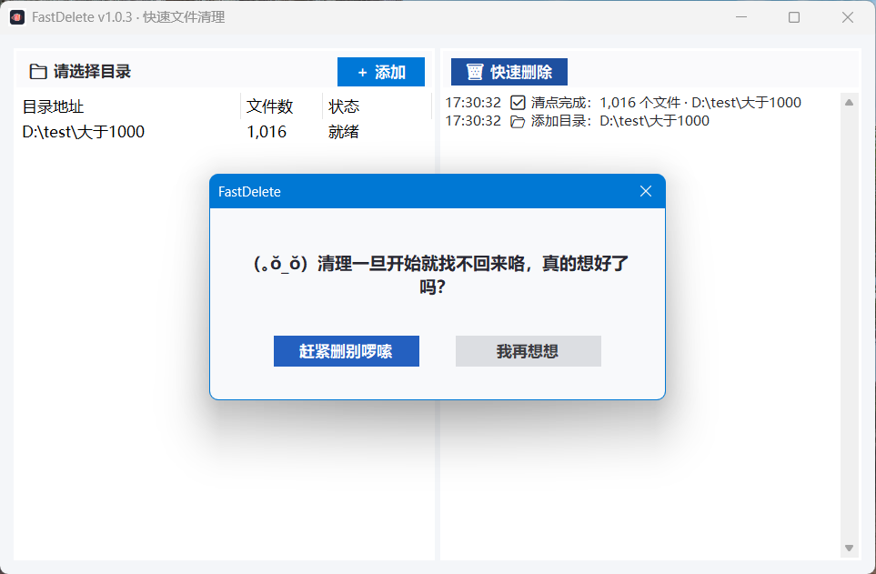
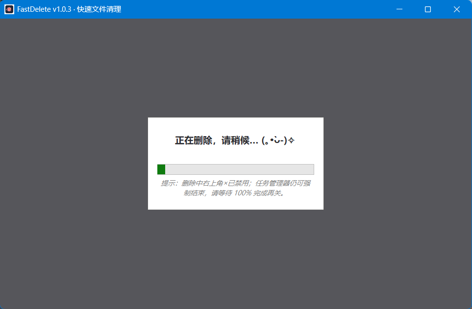
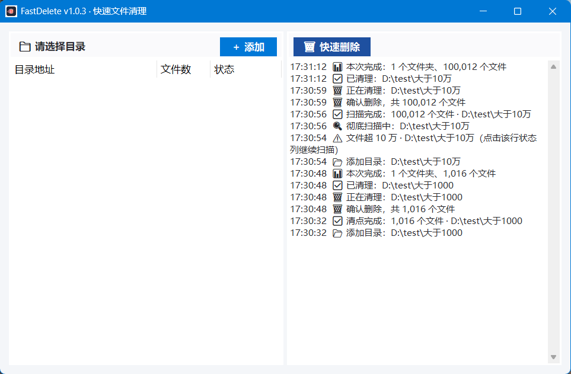

# FastDelete

> **极速删除海量文件**的 Windows 工具——选个文件夹，一键清空。

## 截图

## 构建（开发者）

- 需 .NET 8 SDK；安装版另需 Inno Setup 7（默认 `C:\Program Files\Inno Setup 7\ISCC.exe`）。
- `powershell -File build.ps1 -Install` 一键构建 + 打包 + 安装（版本号自动 +1）。
- 右键菜单走 IExplorerCommand（Win11 第一屏）+ legacy 兜底；注册脚本 `installer\fdreg.ps1` / `fdunreg.ps1` 随包发布，由安装器以管理员身份调用。